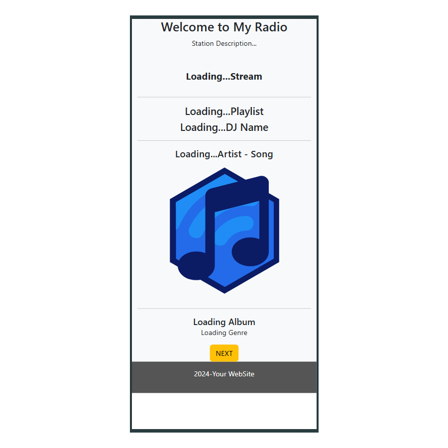

# Azuracast-Radio-Test

Draft inspiration project.

Alternative Public Page for Azuracast

Use outside the playout server (eg: web hosting service).

It's a mix of two projects:

* [Startbootstrap-grayscale](https://github.com/StartBootstrap/startbootstrap-grayscale)
* [Sticky-Responsive-Audio-Player-Jquery](https://github.com/lucasato/Sticky-Responsive-Audio-Player-Jquery)

Testing HTML5 webpage with Sticky Audio Player and Grayscale Bootstrap.

Colecting data from [**azuracast public demo**](https://demo.azuracast.com/)

{ width="300" }

---

[The Player](https://azuracast-radio-test.netlify.app/player.html)

Simple [Webpage](https://azuracast-radio-test.netlify.app/player-api.html) getting API data.

Bootstrap [Test](https://azuracast-radio-test.netlify.app/index.player.html) Bootstrap

---

---
